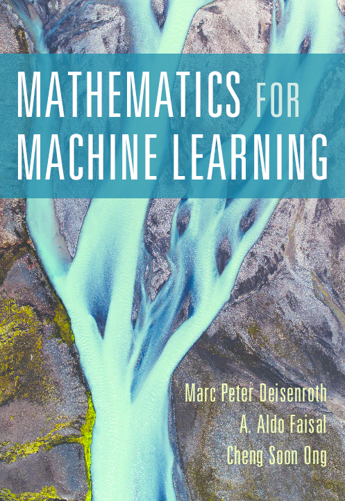

# Mathematics For Machine Learning 
📚 Book by **A. Aldo Faisal**, **Cheng Soon Ong**, and **Marc Peter Deisenroth**

💡**Aim**: _Provide mathematical background to build foundations for readers to dive into other       machine learning textbooks at ease_

***

[**Part I Mathematical Foundations**](#part-1-mathematical-foundations)

1. [Introduction and Motivation](#chapter-1-introduction-and-motivation)
2. [Linear Algebra](#chapter-2-linear-algebra)
3. [Analytic Geometry](#chapter-3-analytic-geometry)
4. [Matrix Decomposition](#chapter-4-matrix-decomposition)
5. [Vector Calculus](#chapter-5-vector-calculus)
6. [Probability and Distribution](#chapter-6-probability-and-distribution)
7. [Continuous Optimization](#chapter-7-continuous-optimization)

[**Part II Central Machine Learning Problem**](#part-2-central-machine-learning-problem)

8. [When Models Meet Data](#chapter-8-when-models-meet-data)
9. [Linear Regression](#chapter-9-linear-regression)
10. [Dimensionality Reduction with Principal Component Analysis](#chapter-10-dimensionality-reduction-with-principal-component-analysis)
11. [Density Estimation with Gaussian Mixture Models](#chapter-11-density-estimation-with-gaussian-mixture-models)
12. [Classification with Support Vector Machines](#chapter-12-classification-with-support-vector-machines)

***
## Chapter 1 Introduction and Motivation

## Chapter 2 Linear Algebra
## Chapter 3 Analytic Geometry
## Chapter 4 Matrix Decomposition
## Chapter 5 Vector Calculus
## Chapter 6 Probability and Distribution
## Chapter 7 Continuous Optimization
## Chapter 8 When Models Meet Data
## Chapter 9 Linear Regression
## Chapter 10 Dimensionality Reduction with Principal Component Analysis
## Chapter 11 Density Estimation with Gaussian Mixture Models
## Chapter 12 Classification with Support Vector Machines
