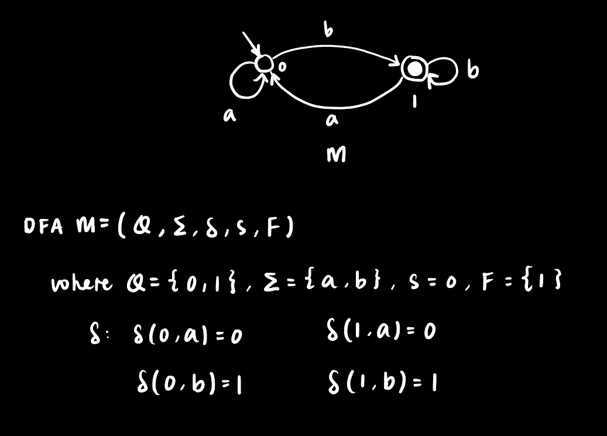
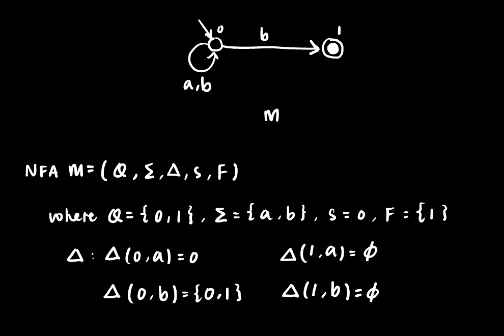
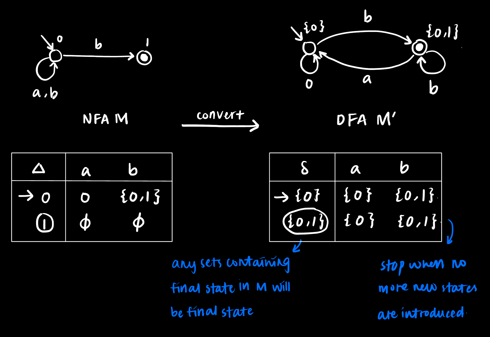
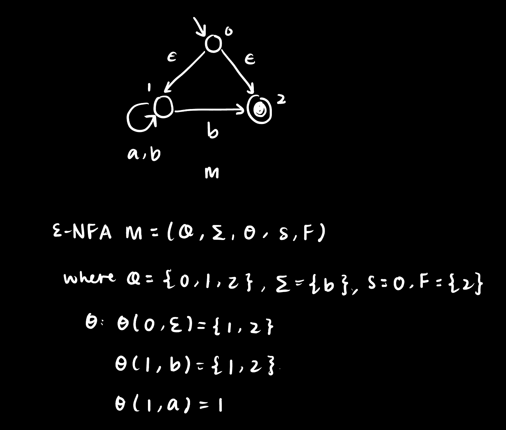
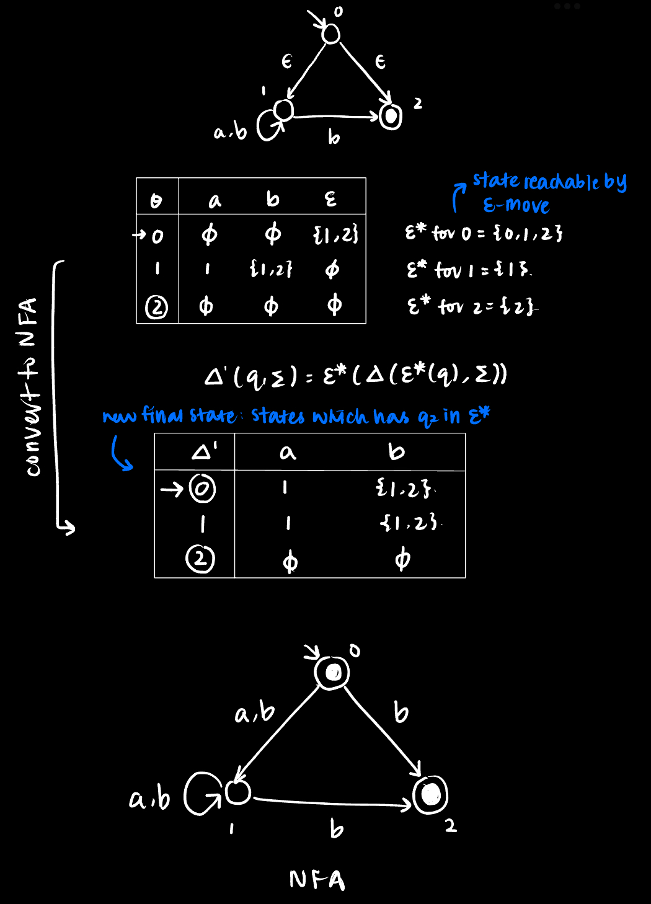
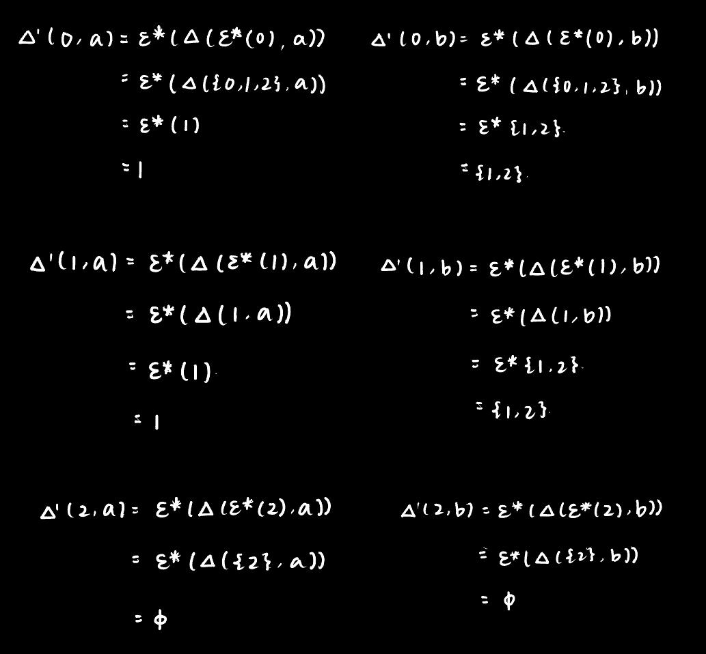

# Theory of Computation
- **Automata theory**
  - [Finite state automata, regular expressions and regular languages](#finite-state-automata-regular-expressions-and-regular-languages)
  - The pumping lemma for regular languages
  - Closure properties of regular languages
  - Context-free grammars and pushdown automata
  - Closure properties of context-free languages
  - The pumping lemma for context-free languages

- **Computability theory**
  - Turing machines, recursively enumerable and recursive languages
  - Church-Turing theses
  - Limitations of algorithms: universality, the halting problem and undecidablity

- **Computational complexity theory**
  - Complexity of algorithms and of problems
  - Complexity classes P, NP, PSPACE
  - Polynomial-time reduction
  - NP-Completeness and Cook's theorem
  - PSPACE-Completeness

## Finite State Automata, Regular Expressions and Regular Languages
### Finite State Automata
> Finite automata are machines with finite number of states that either accept or reject string

**state:** description of system at a point in time

**Deterministic Finite Automaton (DFA)**
> The next state is uniquely determined by current state and input (deterministic)

DFA M = (Q, Σ, Δ, s, F)
- Q: set of states
- Σ: alphabet
- δ: transition function (δ(q,a) = q' means transiting from q to q' upon meeting a)
- s ∈ Q: start state
- F ⊆ Q: set of final states

  

- Deterministic acceptance: DFA will accepts string s if we are able to reach any final states from starting state after finish processing s
- For a DFA M, its language L(M) is the set of all strings accepted by M

**Non-Deterministic Finite Automaton (NDFA)**
> Given current state and input, there can be any number of next states

NFA M = (Q, Σ, δ, s, F)
- Q: set of states
- Σ: alphabet
- Δ: transition function (q' ∈ Δ(q,a) means there is a transition available from q to q' upon meeting a, there could be more than one transition available for single state and input)
- s ∈ Q: start state
- F ⊆ Q: set of final states

  

- Nondeterministic acceptance: NFA accepts string s if there is a path from starting state to any states after processing s (there may be more than one possible paths for a single string, reject only if all paths do not end in final state, accept if there exsit at least one)
- NFAs are at least as powerful as DFAs as they accept at least the languages accepted by DFAs)
  - Any NFAs can also be converted to DFA using subset construction 
  - Example of conversion:
  
    

**Non-Determinitic Finite Automaton with ε-moves (εNFA)**
> Given current state, there is a possible move of epsilon such that the transition will not consume any symbol in string

εNFA M = (Q, Σ, Θ, s, F)
- Q: set of states
- Σ: alphabet
- Θ: transition function (q' ∈ Θ(q,a) means there is a transition available from q to q' upon meeting a, there could be more than one transition available for single state and input), $Θ: Q \times (Σ + \lbrace ε\rbrace) \rightarrow 2^Q$
- s ∈ Q: start state
- F ⊆ Q: set of final states

  

- ε-Nondeterministic acceptance: similar to NFA, accept string s if there is at least one path from starting state to any final states after finish consuming s
- NFA is a special kind of εNFA, one that does not have ε transitions
- Any εNFA can be converted to an NFA so NFA is at least as powerful as NFA
- Example of conversion: 

    
    

### Regular Expressions
- **alphabet Σ:** any finite set of symbols ``(eg. {0,1}, {a,b,c}``
- **string s**: over Σ is a finite sequence of symbols in Σ ``(eg. an example of s over Σ = {0,1} is 0100101)``
- **length #:** number of symbols it contains ``(eg. #(0100) = 4)``
- **empty string ε:** is a string s where #(s) = 0

**Properties of string**
- Two strings s, t over Σ are equal when they have the same symbols in same order (same sequence)
- Set of all string over Σ is denoted as Σ*
- All string is either in the form ε or xσ where σ ∈ Σ
- Length is a function #: Σ* -> N which can be define recursively 
  ``#(ε) = 0, #(xσ) = #(x) + 1``
- Concatenation of two strings s, t ∈ Σ* is denoted as st 
  eg. s = abb, t = ba then st = abbba
- All s satisfies property εs = εs = s
- String containing n copies of a is denoted as a^n, recursive definition:  
  a^0 = ε, a^(n+1) = (a^n)a
 
**Languages**
> A language L over Σ is some set of strings in Σ*  
> Two languages are equal if they contain the same strings (equal as sets) 

Given Σ = {a, b, c}, some examples of languages over Σ are
- L1 = { a^n | n ∈ N }
- L2 = { a^n | n ∈ N is even }
- L3 = { (a^n)(b^n) | n ∈ N }
- L4 = { (a^n)(b^n)(c^n) | n ∈ N }

### Regular Languages
> A language is recognised as regular if it is L(M) for some DFA M
